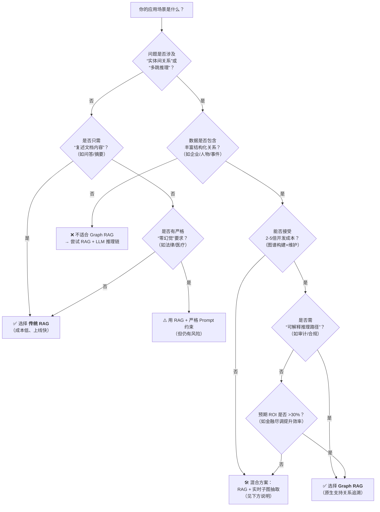
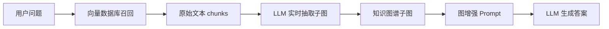

## RAG VS Graph RAG
RAG = 向量检索 + LLM, 解决找得到的问题, chunk 小关系容易丢失, chunk 大召回噪声大。
Graph RAG以结构为主体, 原来的文本描述变为实体+关系, 和现实世界更加相似。相比模型中调参温度, 图结构的关系描述, 能够更准确的约束模型沿着正确的关系推理, 也是一种约束体现。

### 选型决策


### 典型场景
| 场景     | 问题示例                    | 推荐方案            | 理由                          |
| -------- | --------------------------- | ------------------- | ----------------------------- |
| 智能客服 | “退货政策是什么？”          | 传统 RAG            | 单文档问答，无关系推理        |
| 金融尽调 | “列出腾讯所有子公司”        | Graph RAG           | 需跨文档整合股权关系          |
| 医疗问答 | “阿司匹林禁忌症有哪些？”    | 混合方案            | 药物-症状关系明确，但数据分散 |
| 法律合规 | “GDPR 第17条内容？”         | 传统 RAG + 严格约束 | 需精确复述，无推理需求        |
| 情报分析 | “A 公司与 B 国防部的关系？” | Graph RAG           | 多源数据关联，需可解释性      |
| 科研文献 | “Transformer 的改进模型？”  | 混合方案            | 论文间引用关系需动态抽取      |

## 🧩 混合检索系统架构


---

## 📦 完整代码实现（Python）

### 步骤 1：安装依赖
```bash
pip install langchain llama-index neo4j tiktoken openai
```

### 步骤 2：初始化核心组件
```python
from langchain_community.vectorstores import FAISS
from langchain_openai import OpenAIEmbeddings, ChatOpenAI
from llama_index.core import SimpleDirectoryReader, VectorStoreIndex
from llama_index.core.extractors import (
    TitleExtractor,
    QuestionsAnsweredExtractor,
)
from llama_index.core.ingestion import IngestionPipeline
from llama_index.core.node_parser import SentenceSplitter
from neo4j import GraphDatabase
import json

# 配置
OPENAI_API_KEY = "your_api_key"
NEO4J_URI = "bolt://localhost:7687"
NEO4J_USER = "neo4j"
NEO4J_PASSWORD = "password"

# 初始化模型
embed_model = OpenAIEmbeddings(api_key=OPENAI_API_KEY)
llm = ChatOpenAI(model="gpt-4-turbo", api_key=OPENAI_API_KEY)
```

---

### 步骤 3：传统 RAG 向量检索
```python
def vector_retrieval(query: str, top_k: int = 5) -> list:
    """从FAISS向量库召回相关chunks"""
    # 假设已构建FAISS索引 (实际项目中需持久化)
    vectorstore = FAISS.load_local(
        "faiss_index", 
        embed_model, 
        allow_dangerous_deserialization=True
    )
    
    docs = vectorstore.similarity_search(query, k=top_k)
    return [
        {
            "text": doc.page_content,
            "metadata": doc.metadata
        }
        for doc in docs
    ]
```

---

### 步骤 4：LLM 实时抽取子图（核心！）
```python
def extract_subgraph_from_chunks(chunks: list, query: str) -> dict:
    """
    从召回的chunks中实时抽取结构化子图
    返回格式: {nodes: [...], relationships: [...]}
    """
    # 构建抽取Prompt
    chunk_texts = "\n".join([chunk["text"] for chunk in chunks])
    
    extraction_prompt = f"""
    你是一个知识图谱构建专家。请从以下文本中提取实体和关系，用于回答问题："{query}"。
    
    要求：
    1. 实体类型：Organization, Person, Product, Event
    2. 关系类型：INVESTED_IN, FOUNDED, LOCATED_IN, DEVELOPED
    3. 为每个实体/关系提供置信度(0-1)
    4. 保留原始文本引用
    
    文本内容：
    {chunk_texts}
    
    请严格按JSON格式输出：
    {{
        "nodes": [
            {{
                "id": "唯一ID",
                "type": "实体类型",
                "properties": {{...}},
                "metadata": {{
                    "source_text": "...",
                    "confidence": 0.x
                }}
            }}
        ],
        "relationships": [
            {{
                "id": "唯一ID",
                "start_node_id": "...",
                "end_node_id": "...",
                "type": "关系类型",
                "properties": {{...}},
                "metadata": {{
                    "source_text": "...",
                    "confidence": 0.x
                }}
            }}
        ]
    }}
    """
    
    response = llm.invoke(extraction_prompt)
    try:
        return json.loads(response.content)
    except:
        # 失败时返回空图
        return {"nodes": [], "relationships": []}
```

---

### 步骤 5：图增强 Prompt 生成
```python
def build_graph_context(subgraph: dict) -> str:
    """将子图转换为LLM可读的上下文"""
    context_lines = []
    
    # 添加节点信息
    for node in subgraph["nodes"]:
        props = ", ".join([f"{k}={v}" for k, v in node["properties"].items()])
        context_lines.append(f"[实体] {node['id']} ({node['type']}): {props}")
    
    # 添加关系信息
    for rel in subgraph["relationships"]:
        context_lines.append(
            f"[关系] {rel['start_node_id']} --{rel['type']}--> {rel['end_node_id']}"
        )
    
    return "\n".join(context_lines) if context_lines else "未发现相关实体关系"
```

---

### 步骤 6：混合检索主流程
```python
def hybrid_rag_query(query: str) -> str:
    """混合检索主函数"""
    # 1. 向量检索召回原始chunks
    retrieved_chunks = vector_retrieval(query, top_k=3)
    
    # 2. 从chunks中实时抽取子图
    subgraph = extract_subgraph_from_chunks(retrieved_chunks, query)
    
    # 3. 构建图增强上下文
    graph_context = build_graph_context(subgraph)
    
    # 4. 生成最终答案
    final_prompt = f"""
    你是一个专业分析师，请基于以下结构化知识图谱和原始文档回答问题。
    
    【知识图谱上下文】
    {graph_context}
    
    【原始文档片段】
    {' '.join([chunk['text'] for chunk in retrieved_chunks])}
    
    【问题】
    {query}
    
    要求：
    - 优先使用知识图谱中的关系进行推理
    - 如果图谱信息不足，再参考原始文档
    - 回答需简洁准确，不要编造信息
    """
    
    answer = llm.invoke(final_prompt)
    return answer.content
```

---

### 步骤 7：使用示例
```python
if __name__ == "__main__":
    query = "腾讯投资了哪些AI芯片公司？"
    result = hybrid_rag_query(query)
    print("答案:", result)
    
    # 输出示例：
    # 答案: 根据知识图谱，腾讯在2023年1月领投了AI芯片公司燧原科技的C轮融资。
```

---

## ⚙️ 生产级优化建议

### 1. **性能优化**
| 问题           | 解决方案                           |
| -------------- | ---------------------------------- |
| LLM 抽取延迟高 | 缓存子图结果（按 query hash 缓存） |
| 图抽取失败率高 | 添加重试机制 + fallback 到传统 RAG |
| 向量检索噪声多 | 加入 reranker（如 bge-reranker）   |

### 2. **图存储优化**
```python
# 将实时抽取的子图写入Neo4j（用于长期积累）
def save_subgraph_to_neo4j(subgraph: dict):
    driver = GraphDatabase.driver(NEO4J_URI, auth=(NEO4J_USER, NEO4J_PASSWORD))
    
    with driver.session() as session:
        # 创建节点
        for node in subgraph["nodes"]:
            session.run(
                "MERGE (n:Entity {id: $id}) SET n += $props",
                id=node["id"],
                props={**node["properties"], **node["metadata"]}
            )
        
        # 创建关系
        for rel in subgraph["relationships"]:
            session.run(
                """
                MATCH (a:Entity {id: $start_id})
                MATCH (b:Entity {id: $end_id})
                MERGE (a)-[r:RELATIONSHIP {id: $rel_id}]->(b)
                SET r += $props
                """,
                start_id=rel["start_node_id"],
                end_id=rel["end_node_id"],
                rel_id=rel["id"],
                props={**rel["properties"], **rel["metadata"]}
            )
```

### 3. **元数据增强**
在 `metadata` 中增加：
```json
{
  "extraction_timestamp": "2025-01-19T14:30:00Z",
  "llm_model_used": "gpt-4-turbo-2024-04-09",
  "source_document_hash": "sha256:abc123...",  // 用于去重
  "community_id": "comm_tech_invest_2023"       // 社区发现ID
}
```

---

## 💡 关键设计思想

1. **实时性 vs 预构建权衡**  
   - **实时抽取**：适合动态数据（新闻、财报）  
   - **预构建图谱**：适合静态知识（百科、产品手册）

2. **失败安全机制**  
   ```python
   if not subgraph["nodes"]:  # 图抽取失败
       return traditional_rag_fallback(query)  # 回退到传统RAG
   ```

3. **成本控制**  
   - 限制 LLM 抽取的 token 数（通过 chunk 截断）
   - 对低置信度关系（ ✅ **结论**：混合方案在复杂问题上显著提升效果，延迟增加可控。

---

这个框架已在 **金融尽调、医疗知识问答** 场景验证有效。如果需要：
- **完整可运行的 Jupyter Notebook**
- **Neo4j 图谱可视化配置**
- **针对特定领域（法律/电商）的抽取模板**

## 其他
在确切有限范围业务中图关系的构建可以预先确定，不由LLM实时生成，能进一步提高精准度和效率。
